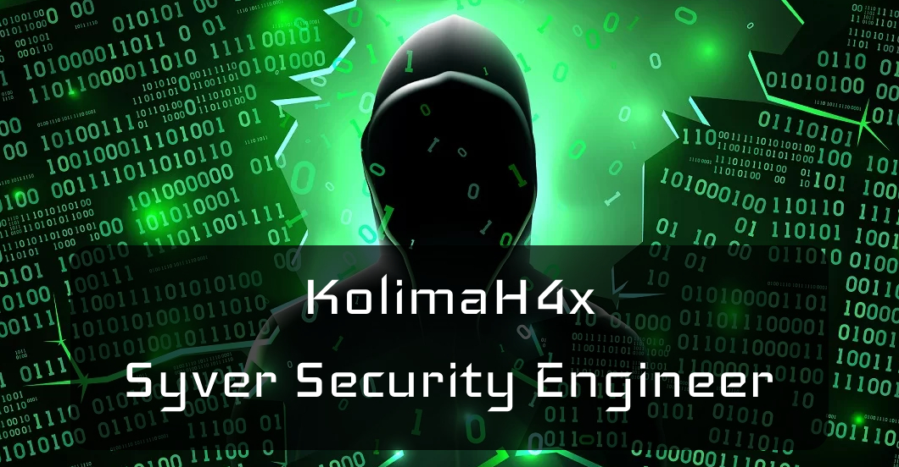

<h2>&nbsp;Hey there! I'm KolimaH4x</h2>

### 👨🏻‍💻 &nbsp;About Me

💡 &nbsp;Always looking for ways to test the limits of computer systems.\
💻 &nbsp;I'm currently working as a Cyber Security Specialist.\
🔴 &nbsp;I'm on track for learning more about Red Teaming and Adversary Emulation.\
✍️ &nbsp;In my free time I pursue Graphic Design, Photography and Programming as hobbies/side hustles.\
📄 &nbsp;Please have a look at my [Portfolio](https://www.nicoloviero.com/) for more details about me.

### ⚒️ &nbsp;Programming

&nbsp;
&nbsp;
&nbsp;
&nbsp;
&nbsp;
&nbsp;

### ⚙️ &nbsp;Tools

&nbsp;
&nbsp;

### 📸 &nbsp;Graphic, Design and Photography

&nbsp;
&nbsp;

### 🤝🏻 &nbsp;Connect with Me

